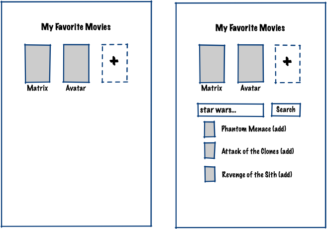

MY FAVORITE MOVIES
==================

Task
-----
Build a basic Rails app for curating a top-ten list of favorite movies from the TMDB API.

 - The user can view their list of favorite movies.
 - The user can search for a movie by title and add it to the list.
 - The user can remove a movie from the list.



It's not necessary to support multiple users or multiple lists. You can style the UI any way
you like; try to make it look nice if you can.


Getting Started
---------------
Before starting the app, you will need to add `TMDB_API_KEY` to your ENV. This repo
is using [dotenv](https://github.com/bkeepers/dotenv), so you can put it in `.env`.

```
TMDB_API_KEY="..."
```

You can get an API key by signing up for a free account https://www.themoviedb.org/signup

This repo includes a minimal TMDB API client in `lib/tmdb/api_client.rb`;you can use and
extend it as needed. Documentation for the TMDB API is available at these links.
- https://www.themoviedb.org/documentation/api
- https://developers.themoviedb.org/3/getting-started/introduction

You can run the app locally or via Docker if you need to.

To start locally:
1. `bundle install`
2. `make start`

To start in Docker:
1. `make docker_build`
2. `make docker_start`
